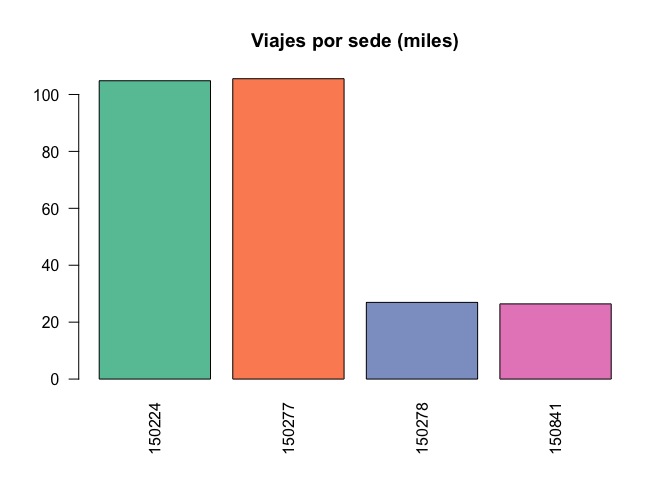
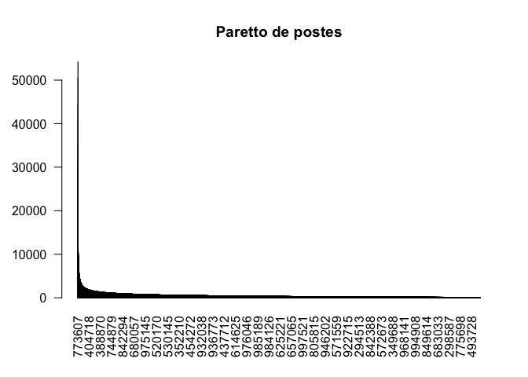
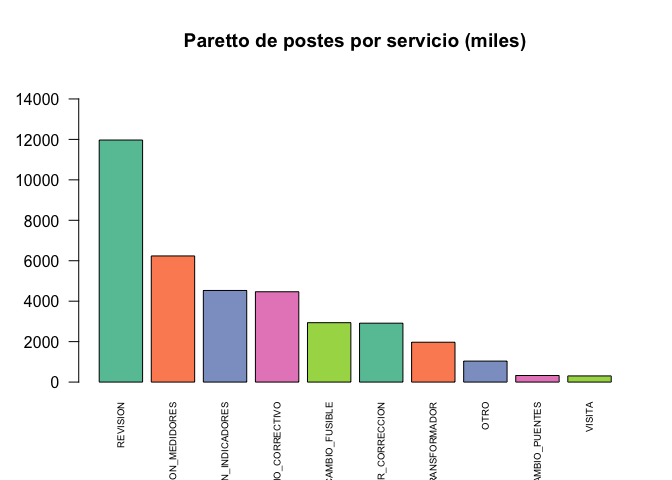
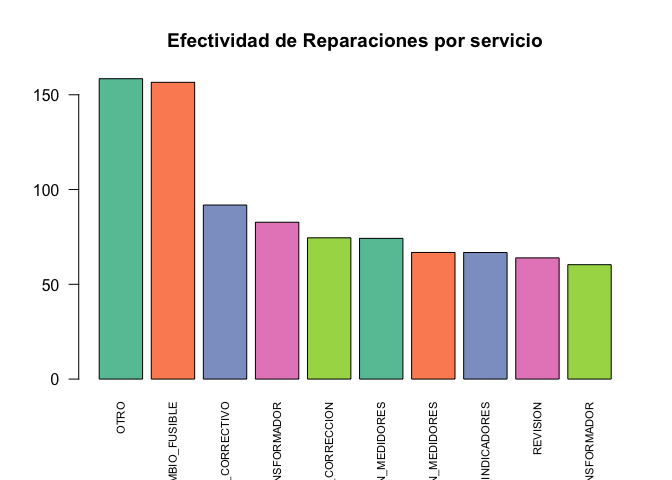
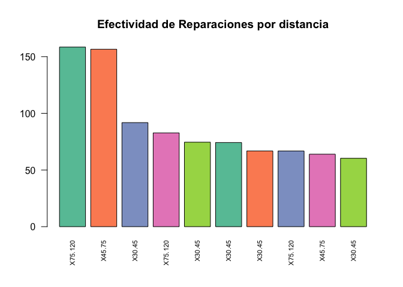

Laboratorio 7
================
Sophia Gamarro
10/11/2020

## LABORATORIO 7

Inversiones en Energía, S.A. de C.V. ha tenido un gran 2017 con una
utilidad superior a los US$1 Millones. Durante estos 9 meses del 2018,
han tenido una baja del 25% con respecto al año anterior en su margen
operativo y el gerente de operaciones ha sido despedido. Usted, como
consultor independiente, ha contactado al nuevo gerente para ofrecerle
un estudio del mercado como de la operación para que el siguiente año la
empresa pueda crecer por encima del 10% con respecto al
    2018.

``` r
data <- data.frame(read_csv("c1.csv"))
```

    ## Warning: Missing column names filled in: 'X23' [23], 'X24' [24], 'X25' [25],
    ## 'X26' [26], 'X27' [27], 'X28' [28]

    ## Parsed with column specification:
    ## cols(
    ##   .default = col_character(),
    ##   ID = col_double(),
    ##   origen = col_double(),
    ##   Lat = col_double(),
    ##   Long = col_double(),
    ##   height = col_double(),
    ##   X23 = col_logical(),
    ##   X24 = col_logical(),
    ##   X25 = col_logical(),
    ##   X26 = col_logical(),
    ##   X27 = col_logical(),
    ##   X28 = col_logical()
    ## )

    ## See spec(...) for full column specifications.

``` r
c_total<- data %>%select(ID, Camion_5, Pickup, Moto)
x <- gather(c_total, key="transporte", value="c_total", Camion_5:Moto)
x <- filter(x, c_total != 'Q-')
data$transporte <- x$transporte
data$c_total <- x$c_total 
```

``` r
c_directo <- data %>%select(ID, directoCamion_5, directoPickup, directoMoto)
x <- gather(c_directo, key="transporte", value="c_directo", directoCamion_5:directoMoto)
x <- filter(x, c_directo != 'Q-')
data$c_directo <- x$c_directo
```

``` r
c_fijo<- data %>%select(ID, fijoCamion_5, fijoPickup, fijoMoto)
x<- gather(c_fijo, key="transporte", value="c_fijo", fijoCamion_5:fijoMoto)
x <- filter(x, c_fijo != 'Q-')
data$c_fijo <- x$c_fijo
```

``` r
c_fijo<- data %>%select(ID, fijoCamion_5, fijoPickup, fijoMoto)
x<- gather(c_fijo, key="transporte", value="c_fijo", fijoCamion_5:fijoMoto)
x <- filter(x, c_fijo != 'Q-')
data$c_fijo <- x$c_fijo
```

``` r
tiempo_mantenimiento <- data%>%select(ID, X5.30, X30.45, X45.75, X75.120, X120.)
tiempo_mantenimiento$X5.30[tiempo_mantenimiento$X5.30=="x"] <- 1
tiempo_mantenimiento$X30.45[tiempo_mantenimiento$X30.45=="x"] <- 1
tiempo_mantenimiento$X45.75[tiempo_mantenimiento$X45.75=="x"] <- 1
tiempo_mantenimiento$X75.120[tiempo_mantenimiento$X75.120=="x"] <- 1
tiempo_mantenimiento$X120.[tiempo_mantenimiento$X120.=="x"] <- 1

x<- gather(tiempo_mantenimiento, key="rangos", value="tiempo", X5.30:X120.)
x <- filter(x, tiempo == '1')
data$tiempo <- x$rangos

a <- dmy(data$Fecha)
b <- as.Date(as.integer(data$Fecha), origin = "1900-01-01") - days(2)
```

    ## Warning in as.Date(as.integer(data$Fecha), origin = "1900-01-01"): NAs
    ## introduced by coercion

``` r
a[is.na(a)] <- b[!is.na(b)] 
data$Fecha <- a 


data$c_directo <- as.numeric(gsub("Q", "", data$c_directo))
data$c_fijo <- as.numeric(gsub("Q", "", data$c_fijo))
data$factura <- as.numeric(gsub("Q", "", data$factura))
data$c_total <- as.numeric(gsub("Q", "", data$c_total))

data <- data %>% mutate(Ganancia = factura -c_total)


#limpiando data de las columnas que no tienen uso
data$directoMoto <- NULL
data$fijoCamion_5 <- NULL
data$fijoPickup <- NULL
data$fijoMoto <- NULL
data$X5.30 <- NULL
data$X30.45 <- NULL
data$X45.75 <- NULL
data$X75.120 <- NULL
data$X120. <- NULL
data$X23 <- NULL 
data$Camion_5 <- NULL
data$Pickup <- NULL
data$Moto <- NULL
data$directoCamion_5 <- NULL
data$directoPickup <- NULL
```

``` r
head(data)
```

    ##        Fecha     ID                    Cod origen      Lat      Long factura
    ## 1 2017-12-10 368224 VERIFICACION_MEDIDORES 150277 15.46333 -89.72565  316.72
    ## 2 2017-03-19 368224 REVISION_TRANSFORMADOR 150277 15.46333 -89.72565  267.24
    ## 3 2017-03-13 368224               REVISION 150277 15.46333 -89.72565  236.04
    ## 4 2017-04-14 368224               REVISION 150224 15.46333 -89.72565  289.77
    ## 5 2017-04-11 748633               REVISION 150277 14.72568 -90.89644  248.33
    ## 6 2017-04-29 599434 VERIFICACION_MEDIDORES 150277 15.93645 -89.04138  299.42
    ##   height X24 X25 X26 X27 X28 transporte c_total c_directo c_fijo tiempo
    ## 1      8  NA  NA  NA  NA  NA   Camion_5  363.17    232.43 130.74  X5.30
    ## 2      8  NA  NA  NA  NA  NA   Camion_5  356.75    221.19 135.57  X5.30
    ## 3      8  NA  NA  NA  NA  NA   Camion_5  377.56    252.96 124.59  X5.30
    ## 4      8  NA  NA  NA  NA  NA   Camion_5  115.97     68.42  47.55  X5.30
    ## 5      8  NA  NA  NA  NA  NA   Camion_5  371.07    241.19 129.87  X5.30
    ## 6     12  NA  NA  NA  NA  NA   Camion_5  353.24    233.14 120.10  X5.30
    ##   Ganancia
    ## 1   -46.45
    ## 2   -89.51
    ## 3  -141.52
    ## 4   173.80
    ## 5  -122.74
    ## 6   -53.82

\#\#Información

``` r
#Tipos de Servicio Disponibles
data %>% select(Cod) %>%distinct
```

    ##                         Cod
    ## 1    VERIFICACION_MEDIDORES
    ## 2    REVISION_TRANSFORMADOR
    ## 3                  REVISION
    ## 4            CAMBIO_FUSIBLE
    ## 5                      OTRO
    ## 6         CAMBIO_CORRECTIVO
    ## 7  VERIFICACION_INDICADORES
    ## 8                    VISITA
    ## 9     VISITA_POR_CORRECCION
    ## 10           CAMBIO_PUENTES

``` r
#Transporte utilizado
data %>% select(transporte) %>%distinct
```

    ##   transporte
    ## 1   Camion_5
    ## 2     Pickup
    ## 3       Moto

``` r
#Origen
data %>% select(origen) %>%distinct
```

    ##   origen
    ## 1 150277
    ## 2 150224
    ## 3 150841
    ## 4 150278

\#\#Pregunta 1: Estado de Resultados Breve 2017

``` r
ventas_totales <- sum(data$factura)
sprintf("Ventas Netas: %.2f", ventas_totales)
```

    ## [1] "Ventas Netas: 36688096.31"

``` r
costos <- sum(data$c_total)
sprintf("Costo Total: %.2f", costos)
```

    ## [1] "Costo Total: 28174019.31"

``` r
ganancia <- ventas_totales - costos
sprintf("Utilidad Bruta: %.2f", ganancia)
```

    ## [1] "Utilidad Bruta: 8514077.00"

\#\#Pregunta 2: Tarifario en el 2017 por
Unidad

``` r
resultado_tarifario <- aggregate(x = data$factura, by=list(data$transporte), mean)
colnames(resultado_tarifario)<-c('Transporte', 'Tarifa')
resultado_tarifario
```

    ##   Transporte   Tarifa
    ## 1   Camion_5 130.6234
    ## 2       Moto 129.0382
    ## 3     Pickup 142.1111

\#\#Pregunta 3: Las tarifas actuales ¿son aceptables por el cliente?
¿Estamos en números
rojos?

``` r
reparaciones_mes <- data %>%group_by(reparaciones_mes= month(Fecha)) %>%count(ID)
reparaciones_mes <- reparaciones_mes %>%group_by(reparaciones_mes) %>%summarise(total = sum(n))
```

``` r
barplot(reparaciones_mes$total, names.arg = reparaciones_mes$reparaciones_mes, las=2, main="Reparaciones mensuales",  col=coul)
```

<!-- -->

\#\#Pregunta 4: ¿Cuándo podríamos perderle a un mantenimiento y/o
reparación?

``` r
perdidas_mant_reparacion <- data %>% filter(Ganancia < 0) %>%group_by(Cod) %>%count(Cod, sort = TRUE)
perdidas_mant_reparacion
```

    ## # A tibble: 10 x 2
    ## # Groups:   Cod [10]
    ##    Cod                          n
    ##    <chr>                    <int>
    ##  1 REVISION                 30932
    ##  2 VERIFICACION_MEDIDORES   15921
    ##  3 CAMBIO_CORRECTIVO        13928
    ##  4 VERIFICACION_INDICADORES 10826
    ##  5 CAMBIO_FUSIBLE            5331
    ##  6 VISITA_POR_CORRECCION     3507
    ##  7 REVISION_TRANSFORMADOR    3332
    ##  8 OTRO                       924
    ##  9 VISITA                     892
    ## 10 CAMBIO_PUENTES             347

``` r
barplot(perdidas_mant_reparacion$n, names.arg = perdidas_mant_reparacion$Cod, las=2, main="Pérdidas de Servicios",  col=coul )
```

<!-- -->

\#\#Pregunta 5: ¿Debemos abrir más centros de distribución?

``` r
distribucion <- count(data, data$origen)
colnames(distribucion)<-c('origen', 'Servicios')
distribucion$Servicios <- (distribucion$Servicios)/1000
```

``` r
barplot(distribucion$Servicios, names.arg = distribucion$origen, las=2, main="Viajes por sede (miles)",  col=coul )
```

<!-- -->

\#\#“80-20” de factura (puede variar el porcentaje) y cuáles postes
requieren de más mantenimiento.

``` r
postes_mant<- data %>% group_by(ID) %>% summarise(Total = sum(factura))
postes_mant <- postes_mant[order(-postes_mant$Total),]
postes_mant <- postes_mant %>% mutate(Percent = Total/ventas_totales)
```

``` r
barplot(postes_mant$Total, names.arg = postes_mant$ID, las=2, main="Paretto de postes",  col=coul)
```

<!-- -->

``` r
options(scipen = 999)     
mantenimiento<- data %>%group_by(Cod) %>%summarise(Total = sum(factura)/1000)
mantenimiento <- mantenimiento[order(-mantenimiento$Total),]
```

``` r
barplot(mantenimiento$Total, names.arg = mantenimiento$Cod, las=2, main="Paretto de postes por servicio (miles)", cex.names = 0.6, ylim = c(0,15000),  col=coul )
```

<!-- -->
\#\#Recorridos más efectivos

``` r
efectividad <- data %>%mutate(Efectividad = Ganancia/c_total)
efectividad <- efectividad %>% filter(Efectividad > 0)
efectividad <- efectividad %>% select(ID, Cod, tiempo, Efectividad)
efectividad <- efectividad[order(-efectividad$Efectividad),]
efectividad <- efectividad[0:10,]
```

``` r
barplot(efectividad$Efectividad, names.arg = efectividad$Cod, las=2, main="Efectividad de Reparaciones por servicio", cex.names = 0.7,  col=coul )
```

<!-- -->

``` r
barplot(efectividad$Efectividad, names.arg = efectividad$tiempo, las=2, main="Efectividad de Reparaciones por distancia", cex.names = 0.7,  col=coul )
```

<!-- -->
